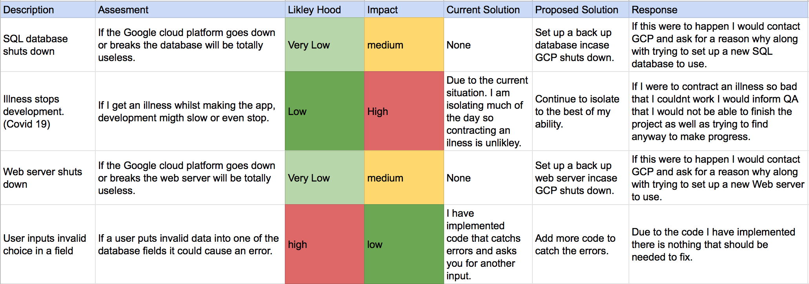
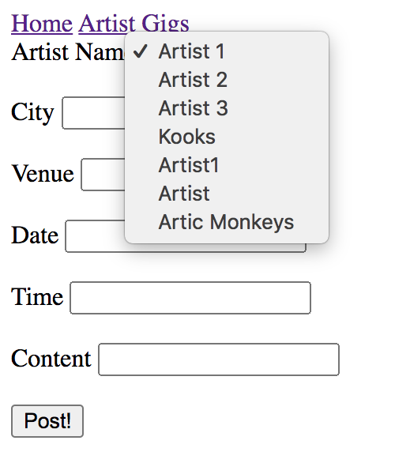

# QA SFIA Project 1

<!-- TABLE OF CONTENTS -->
## Table of Contents

* [About the Project](#about-the-project)
* [Entity Relationship Diagram](#entity-relationship-diagram)
* [Jira Board](#jira-board)
* [Risk Analysis](#risk-analysis)
* [CI Pipeline](#ci-pipeline)
* [Front End Design](#front-end-design)
* [Testing](#testing)
* [Whats Wrong](#whats-wrong)
* [Future Improvements](#future-improvements)
* [Author](#author)

<!-- ABOUT THE PROJECT -->
## About The Project

The main goals for this project were outlined as "To create a CRUD application with utilisation of supporting tools, methodologies and technologies that encapsulate all core modules covered during training."

Main Objectives:
* Create a Jira board (or equivalent Kanban board tech) with full expansion
on user stories, use cases and tasks needed to complete the project.
* Create a relational database used to store data persistently for the
project, this database needs to have at least 2 tables in it.
* Create clear documentation from the design phase describing the architecture
you will use for you project as well as a detailed Risk Assessment.
* Create a functional CRUD application created in Python.
* Create fully designed test suites for the application, as well as automated tests for validation of the application.
* Make a functioning front-end website and integrated API's, using Flask.
* Make sure that the code fully integrated into a Version Control System.

## My App Idea

My basic app idea consisted of a simple app that allowed the user to add artists to an artists table in the database and then add gigs to a gig table that include those said artists.  The app will also let the user delete gigs and update them. 

### Gigs
- Artist Name
- City
- Venue
- Gig Date
- Gig Time
- Description

### Artist

- Artist Name

## Entity Relationship Diagram

This is the final entity relationship entity diagram for my project. I chose to keep it very simple and straight foward so that I could focus on hitting every objective of the project.  As you can see there is a one to many relationship between the artist and gig tables.  This is because one artist can have many gigs and a gig can only have one artist.

## Jira Board

I used Jira to plan out and keep track of my project. I used a Kanban board with full expansion
on user stories, use cases and tasks needed to complete the project.
It could also provide a record of any issues or risks that you faced
creating your project.

## Risk Analysis

This is a risk assessment that I carried out on the project.

https://docs.google.com/spreadsheets/d/1xI08u7esTqbOR0hwvc36yBdpmpYVrrePsfu_f_EBQsQ/edit?usp=sharing

## CI Pipeline 

I automated the build, test and deployment process using the CI server Jenkins.  I did this by adding a webhook to GitHub which was triggered by every push event. If there is an error with the testing, Jenkins does not run run the build step. Ensuring that a brocken app will not be built.
This is a CI Pipeline that details the life cycle of my project.

## Front end Design

The images below show the design of my app:

### Entering New Artist

### Entering New Gig

### Posting Gig

### Updating Gig

### Post Updated Gig

## Testing

Pytest is used to run unit tests on the app. These are designed to assert that if a certain function is run, the output should be a known value. Pytest produces coverage reports (Which you can see below) that show how much of the app the tests cover. In this case it was 100%.

I also implemented some integrated testing which uses selenium and chrome to run tests. For this I wrote two tests that tested both the inserting of an artist and a gig.

## Whats Wrong

Some problems that are present in the app are that when you update a gig, brackets and commas appear around the city and venue and if you don't delete them and click update, they then become apart of the updated gig details.

## Future Improvements

 - One main improvement I would like to make is improving the front end design.  This will be done by using css to style the web page.

 - Another improvement I would like to make is implementing a log in system so that multiple users can have their own personalised gigs and artists.

 ## Author
 

 Bradley Daniels
